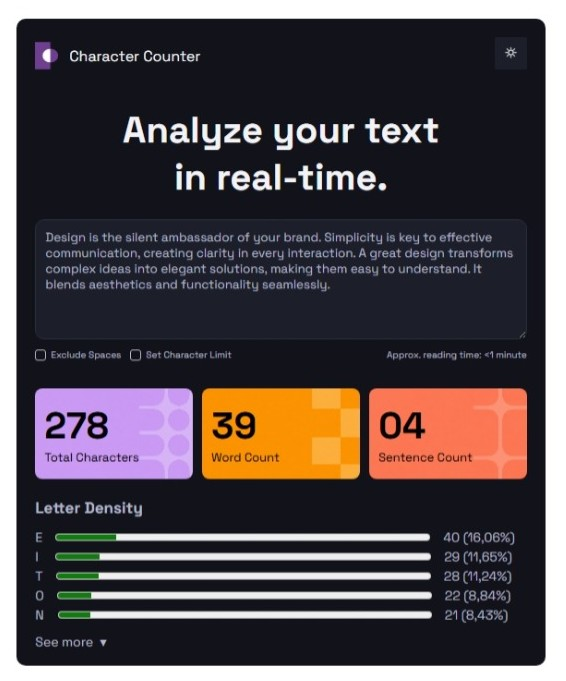
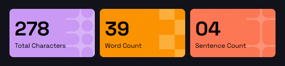
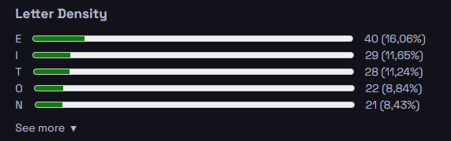

# Proyecto de Maquetado Web - Character Counter (HTML + CSS)

## 1. Objetivo del proyecto

El objetivo de este primer proyecto fue replicar visualmente la interfaz dada utilizando únicamente HTML y CSS, para aplicar lo aprendido en cada clase.

Se buscó reproducir el diseño de referencia respetando la distribución visual, la jerarquía de la información, los colores, los espacios, los bordes, las cards de métricas y, la alineación y densidad de los textos.

---

## 2. Tecnologías utilizadas

- HTML
- CSS
- Git
- GitHub

---

## 3. Organización del HTML

La estructura del proyecto fue dividida en secciones principales:

### Header
- Logo
- Nombre del sitio
- Botón para cambiar el tema del sitio (dark-light)

### Hero principal
- Título principal
- Un área para escribir texto utilizando `<textarea>` + placeholder

### Controles
- Checkbox "Exclude Spaces"
- Checkbox "Set Character Limit"
- Tiempo estimado de lectura

### Cards de métricas
- Total Characters
- Word Count
- Sentence Count

### Letter Density
- Título de la sección
- Letras analizadas
- Barras de progreso utilizando `<meter>`
- Valores y porcentajes correspondientes

---

## 4. Resolución del CSS

Para el diseño se utilizaron:

### Variables CSS
Se definió una paleta de colores con variables mediante `:root` para facilitar el mantenimiento del código y la prolijidad del mismo.

### Flexbox
Utilicé Flexbox para:
- Header
- Controles inferiores
- Distribución de las cards de métricas

### Estilos
- Reset de los valores por defecto (`margin`, `padding`, `box-sizing` y `font-family`)
- Bordes redondeados (`border-radius`)
- Efectos `:hover` en el botón del tema del sitio
- Fondos personalizados para cada card con `img`
- Personalización de `checkbox`
- Estilos para `textarea` y placeholders
- Utilización de `display: flex;`, `justify-content` y `align-items` para manipular la orientación, la justificación y la alineación de los `div`

### Barras de progreso
Se implementaron utilizando la etiqueta HTML `<meter>` y estilos CSS para replicar el contenido original.

---

## 5. Dificultades encontradas

Durante el desarrollo encontré algunas dificultades:

- Personalizar visualmente los `checkbox` manteniendo una apariencia similar al diseño de referencia, especificamente con `justify-content: space-between`.
- Lograr una alineación consistente entre las barras de progreso y sus porcentajes (hay una pequeña diferencia en el comienzo de los últimos tres `meter` con el resto).
- Reproducir los fondos de las cards (se utilizó IA para recrear las imagenes de `background`).

---

## 6. Capturas del resultado final

### Vista completa

Agregar aquí una captura del proyecto:

### Sección de barras

### Sección Letter Density

---

## Autor

Agustin Simone